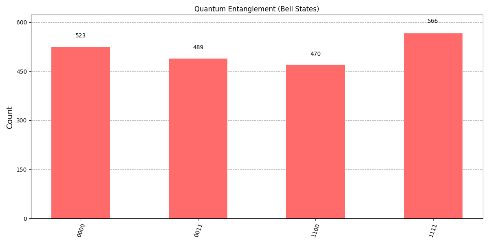
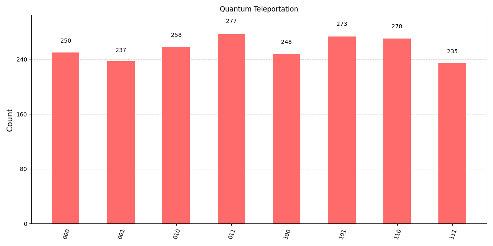
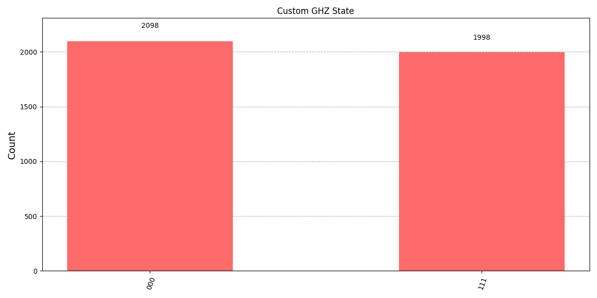
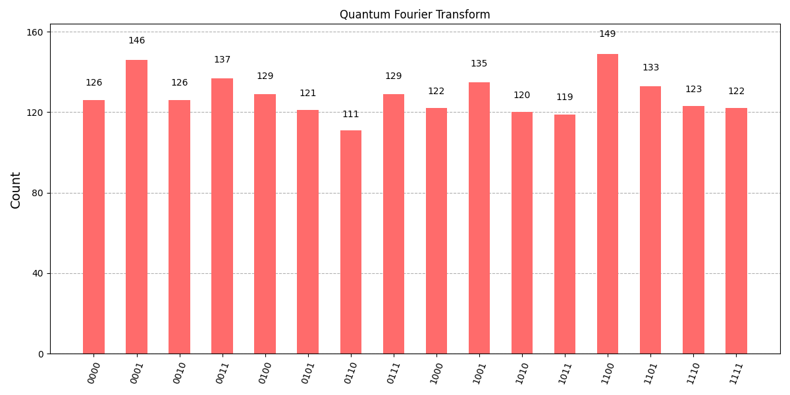
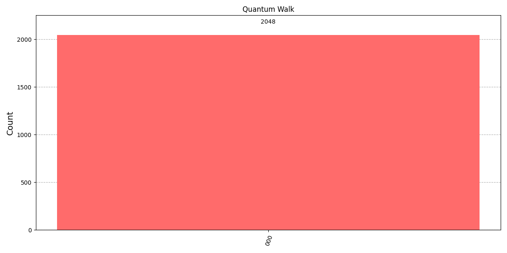
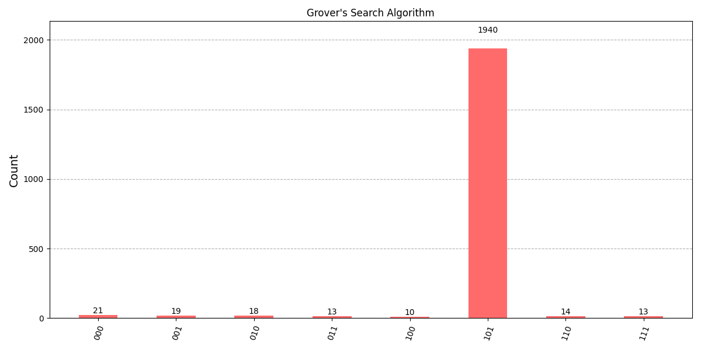
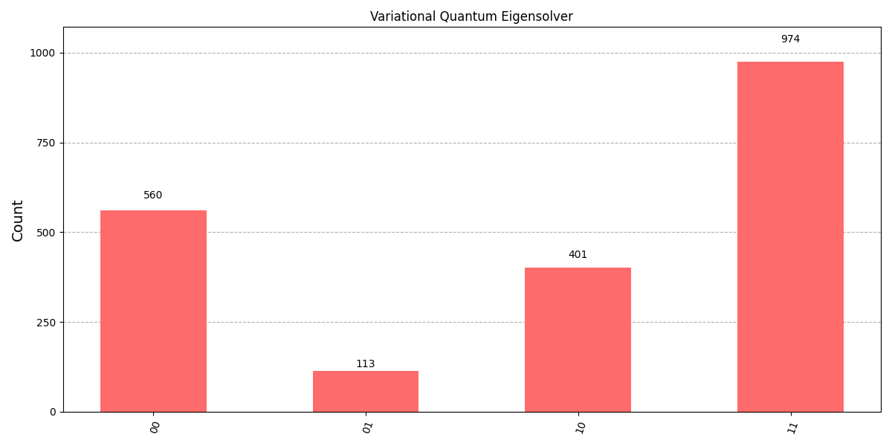
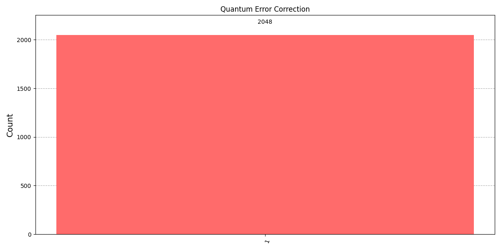

<p align="center">
  <h1 align="center">Advanced Quantum Computing Application</h1>
  <p align="center">
    <strong>A comprehensive quantum computing toolkit featuring 11 advanced algorithms</strong>
  </p>
  <p align="center">
    <a href="https://www.python.org/downloads/"></a>
    <a href="https://qiskit.org/"></a>
    <a href="LICENSE"></a>
    <a href="https://github.com/rasidi3112/Advanced-Quantum-App"></a>
  </p>
</p>

---

## Table of Contents

- [Overview](#overview)
- [Algorithms](#algorithms)
- [Gallery](#gallery)
- [Installation](#installation)
- [Usage](#usage)
- [Project Structure](#project-structure)
- [API Reference](#api-reference)
- [Testing](#testing)
- [Contributing](#contributing)
- [License](#license)

---

## Overview

This project implements **11 quantum computing algorithms** using IBM's [Qiskit](https://qiskit.org/) framework. It is designed for **education**, **research**, and **experimentation** with quantum computing concepts.

### Key Features

| Feature | Description |
|---------|-------------|
| **11 Algorithms** | From Bell States to Simon's Algorithm |
| **Premium Visualizations** | Dark-themed histograms with gradient colors |
| **CLI Interface** | Run specific algorithms with custom parameters |
| **Modular Architecture** | Clean package structure with separated modules |
| **Tested** | Comprehensive unit test suite with pytest |
| **Documented** | Detailed explanations with theoretical background |

---

## Algorithms

### Core Algorithms

| # | Algorithm | Speedup | Description |
|---|-----------|---------|-------------|
| 1 | **Quantum Entanglement** | — | Bell State creation demonstrating quantum correlation |
| 2 | **Quantum Teleportation** | — | State transfer using entanglement + classical bits |
| 3 | **Grover's Search** | O(√N) vs O(N) | Quadratic speedup for unstructured database search |
| 4 | **Quantum Fourier Transform** | O(n²) vs O(n·2ⁿ) | Quantum analogue of discrete Fourier transform |
| 5 | **Phase Estimation** | O(1/2ⁿ) precision | Eigenvalue estimation for unitary operators |
| 6 | **VQE** | Hybrid | Variational ground state energy finder |
| 7 | **Quantum Walk** | O(t) vs O(√t) | Quantum random walk with ballistic spreading |
| 8 | **Error Correction** | — | 3-qubit bit-flip code with syndrome detection |

### New Algorithms (v2.0)

| # | Algorithm | Speedup | Description |
|---|-----------|---------|-------------|
| 9 | **Deutsch-Jozsa** | O(1) vs O(2ⁿ⁻¹+1) | Constant vs balanced function determination |
| 10 | **Bernstein-Vazirani** | O(1) vs O(n) | Hidden binary string discovery |
| 11 | **Simon's Algorithm** | O(n) vs O(2ⁿ/²) | Hidden period finding (inspired Shor's algorithm) |

---

## Gallery

| Entanglement | QFT | Grover's Search |
|:---:|:---:|:---:|
|  |  |  |

| Teleportation | Phase Estimation | VQE |
|:---:|:---:|:---:|
|  |  |  |

| Quantum Walk | Error Correction | GHZ State |
|:---:|:---:|:---:|
|  |  |  |

---

## Installation

### Prerequisites

- **Python 3.9+**
- **pip** (Python package manager)

### Setup

```bash
# 1. Clone the repository
git clone https://github.com/rasidi3112/Advanced-Quantum-App.git
cd Advanced-Quantum-App

# 2. Create a virtual environment
python3 -m venv venv

# 3. Activate the virtual environment
# macOS/Linux:
source venv/bin/activate
# Windows (PowerShell):
venv\Scripts\Activate.ps1

# 4. Install dependencies
pip install -r requirements.txt
```

---

## Usage

### Run All Algorithms

```bash
python main.py
```

### Run Specific Algorithm(s)

```bash
# Single algorithm
python main.py -a grover

# Multiple algorithms
python main.py -a grover -a qft -a entanglement
```

### Custom Parameters

```bash
# Higher precision (more shots)
python main.py --shots 4096

# Save images to disk
python main.py --save-images

# Headless mode (no interactive plots)
python main.py --no-plot --save-images

# Custom GHZ state
python main.py --ghz 5

# Combine options
python main.py -a grover --shots 8192 --save-images --no-plot
```

### List Available Algorithms

```bash
python main.py --list
```

**Output:**
```
═══════════════════════════════════════════════════════════════════════════════
  Available Quantum Algorithms
═══════════════════════════════════════════════════════════════════════════════
  Key                    Algorithm                           Description
  ────────────────────── ─────────────────────────────────── ────────────────
  entanglement           Quantum Entanglement (Bell States)  Creates entangled Bell pairs...
  teleportation          Quantum Teleportation               Transfers quantum state...
  grover                 Grover's Search Algorithm           Quadratic speedup...
  qft                    Quantum Fourier Transform           Quantum analogue of DFT...
  phase-estimation       Quantum Phase Estimation            Estimates eigenvalues...
  vqe                    Variational Quantum Eigensolver     Hybrid ground state finder...
  quantum-walk           Quantum Random Walk                 Ballistic spreading...
  error-correction       Quantum Error Correction (3-qubit)  Bit-flip correction...
  deutsch-jozsa          Deutsch-Jozsa Algorithm             Constant vs balanced...
  bernstein-vazirani     Bernstein-Vazirani Algorithm        Hidden string discovery...
  simon                  Simon's Algorithm                   Hidden period finding...
═══════════════════════════════════════════════════════════════════════════════
```

### Python API

```python
from quantum_app import AdvancedQuantumApp
from quantum_app.algorithms import create_grover_circuit

# Initialize
app = AdvancedQuantumApp()

# Run single algorithm
circuit = create_grover_circuit(n_qubits=3, target='110')
counts = app.execute_circuit(circuit, shots=4096)
app.visualize(counts, title="Grover's Search")

# Run all demos
app.run_comprehensive_demo(shots=2048, save_images=True)

# Analyze entanglement
from quantum_app.algorithms import create_entanglement_circuit
bell_circuit = create_entanglement_circuit(n_pairs=2)
entropy = app.analyze_entanglement(bell_circuit)
print(f"Entanglement entropy: {entropy:.4f} bits")
```

---

## Project Structure

```
Advanced-Quantum-App/
├── quantum_app/                    # Main package
│   ├── __init__.py                 # Package init, version, exports
│   ├── core.py                     # AdvancedQuantumApp orchestrator
│   ├── visualization.py            # Premium dark-themed visualizations
│   ├── utils.py                    # Logging, formatting, analysis helpers
│   └── algorithms/                 # Algorithm implementations
│       ├── __init__.py             # Algorithm exports
│       ├── entanglement.py         # Bell States
│       ├── teleportation.py        # Quantum Teleportation
│       ├── grover.py               # Grover's Search
│       ├── qft.py                  # Quantum Fourier Transform
│       ├── phase_estimation.py     # Phase Estimation
│       ├── vqe.py                  # Variational Quantum Eigensolver
│       ├── quantum_walk.py         # Quantum Random Walk
│       ├── error_correction.py     # 3-Qubit Error Correction
│       ├── deutsch_jozsa.py        # Deutsch-Jozsa (NEW)
│       ├── bernstein_vazirani.py   # Bernstein-Vazirani (NEW)
│       └── simon.py               # Simon's Algorithm (NEW)
├── tests/
│   ├── __init__.py
│   └── test_algorithms.py         # Comprehensive unit tests
├── images/                         # Result visualizations
├── main.py                         # CLI entry point
├── requirements.txt                # Dependencies (pinned versions)
├── setup.py                        # Package setup
├── LICENSE                         # MIT License
├── README.md                       # This file
└── .gitignore                      # Git ignore rules
```

---

## API Reference

### `AdvancedQuantumApp`

The main application class providing unified access to all algorithms.

| Method | Description |
|--------|-------------|
| `execute_circuit(circuit, shots=1024, name=None)` | Execute a quantum circuit on the simulator |
| `analyze_entanglement(circuit)` | Compute von Neumann entropy of a circuit |
| `visualize(counts, title, save_path, palette_key, show)` | Create premium histogram visualization |
| `get_all_demos()` | Get list of all 11 demo circuits |
| `run_comprehensive_demo(shots, save_images, images_dir, show_plots)` | Run all algorithms with output |
| `run_custom_ghz(n_qubits, shots, ...)` | Run GHZ state demo |

### Algorithm Factory Functions

Each algorithm module exports a `create_*_circuit()` function:

| Function | Parameters |
|----------|------------|
| `create_entanglement_circuit(n_pairs=2)` | Number of Bell pairs |
| `create_teleportation_circuit()` | — |
| `create_grover_circuit(n_qubits=3, target='101')` | Qubits, target state |
| `create_qft_circuit(n_qubits=4)` | Number of qubits |
| `create_phase_estimation_circuit(n_counting_qubits=3)` | Counting qubits |
| `create_vqe_circuit(n_qubits=2, theta_1, theta_2)` | Qubits, rotation angles |
| `create_quantum_walk_circuit(steps=3)` | Number of walk steps |
| `create_error_correction_circuit()` | — |
| `create_deutsch_jozsa_circuit(n_qubits=3, oracle_type='balanced')` | Qubits, oracle |
| `create_bernstein_vazirani_circuit(secret='101')` | Hidden string |
| `create_simon_circuit(secret='110')` | Period string |

---

## Testing

Run the test suite:

```bash
# Run all tests
python -m pytest tests/ -v

# Run with coverage report
python -m pytest tests/ -v --cov=quantum_app

# Run specific test class
python -m pytest tests/test_algorithms.py::TestCircuitExecution -v
```

---

## Contributing

Contributions are welcome! Here's how:

1. **Fork** the repository
2. **Create** a feature branch (`git checkout -b feature/new-algorithm`)
3. **Write** tests for your changes
4. **Commit** your changes (`git commit -m 'Add new algorithm'`)
5. **Push** to the branch (`git push origin feature/new-algorithm`)
6. **Open** a Pull Request

### Guidelines

- Follow existing code style and documentation patterns
- Add comprehensive docstrings with theory explanations
- Include unit tests for all new algorithms
- Update this README with new algorithm details

---

## License

This project is licensed under the **MIT License** — see the [LICENSE](LICENSE) file for details.

---

<p align="center">
  Made by <a href="https://github.com/rasidi3112">rasidi3112</a>
</p>
