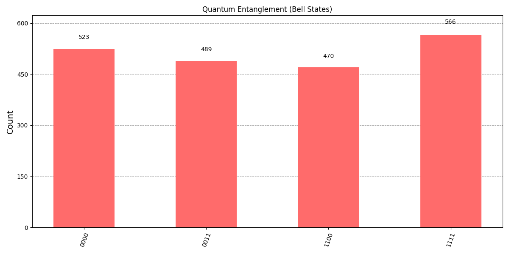
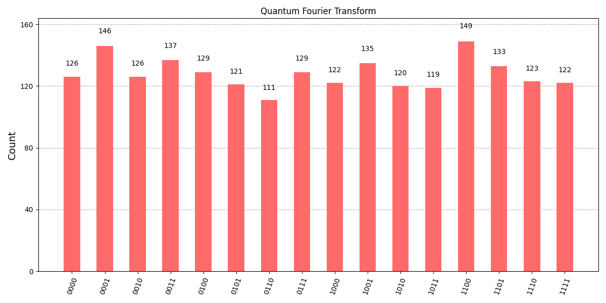
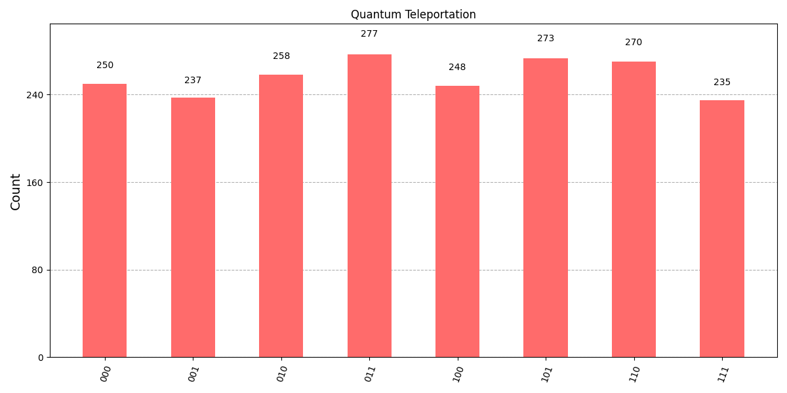
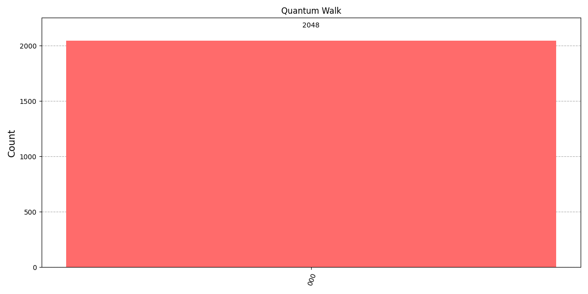
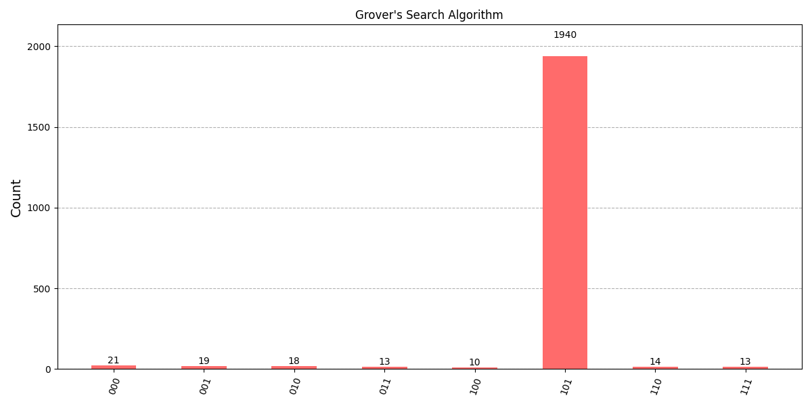
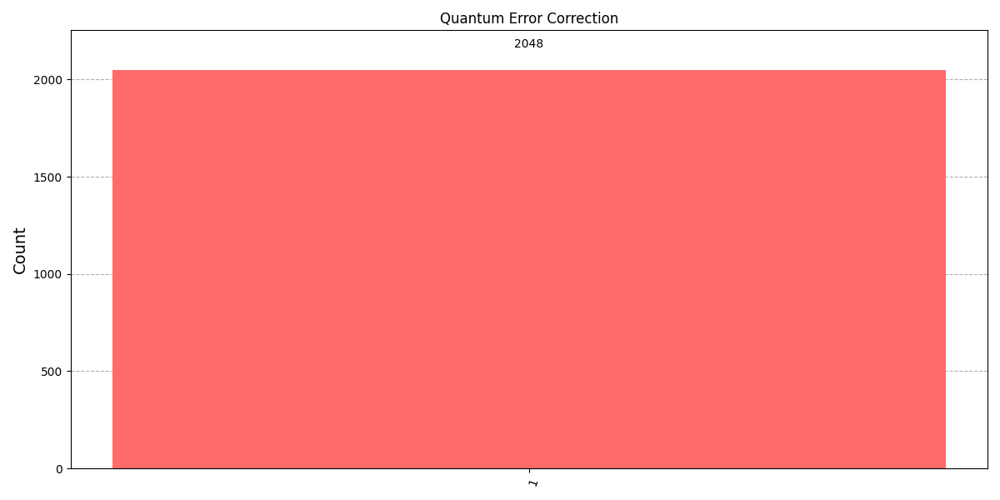

# Advanced Quantum Computing Application

Aplikasi Quantum Computing Canggih dengan Multiple Algorithms menggunakan **Qiskit**.


# Advanced Quantum Computing Application  

|  |  | Figure_10.png |
|-----------------------------------------|-------------------------------------------|-------------------------------|
|                   |     |        |
|         |     |  |


## Deskripsi
Project ini menampilkan berbagai algoritma quantum canggih:
- Quantum Entanglement (Bell States)
- Quantum Teleportation
- Grover's Search Algorithm
- Quantum Fourier Transform (QFT)
- Quantum Phase Estimation
- Variational Quantum Eigensolver (VQE)
- Quantum Random Walk
- Quantum Error Correction

Project ini menggunakan **Python 3**, **Qiskit**, dan **Matplotlib** untuk visualisasi hasil.

## Instalasi

1. Pastikan Python 3 sudah terinstall.
2. Install dependencies:

```bash
pip install -r requirements.txt
